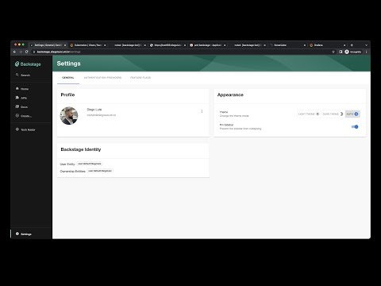
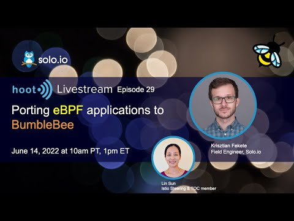
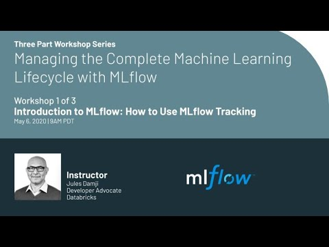

# 2022 July Links

## Using backstage as a microservices dashboard

## Review eBPF

## Guide to manage incidents

https://incident.io/guide/

## SLOs

https://sre.google/resources/practices-and-processes/art-of-slos/

## Managing the Complete Machine Learning Lifecycle with MLflow

## Seldon

https://docs.seldon.io/projects/seldon-core/en/latest/workflow/github-readme.html

## ML Tools compared

https://valohai.com/mlops-platforms-compared/

## Operators

https://files.aoyfe.online/file/dwsr-public-files/GMT20220608-160431_Recording_1920x1118.mp4

## Gloo workshops

https://workshops.solo.io/

## Resources to Engineer Manager

https://medium.com/thatoneaspiringengineeringmanager/resources-for-aspiring-engineering-managers-b3888f896b05
